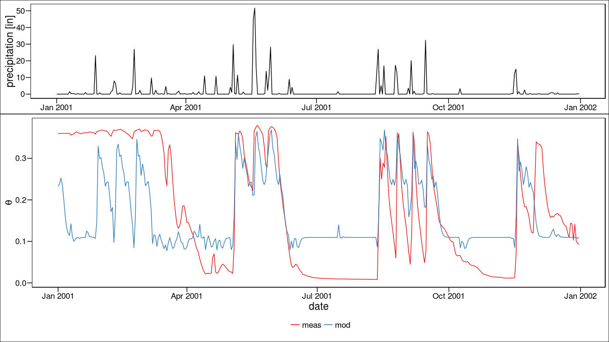

# Attempt at an RNN model for predicting soil moisture

All of the semi-delusional code lives in rnn-test.R. 

The data are from the [Texas A&M soil moisture database](http://soilmoisture.tamu.edu/) and NOAA via the [rnoaa package](https://cran.rstudio.com/web/packages/rnoaa/). Training was done using the [rnn package](https://cran.r-project.org/web/packages/rnn/index.html). A formatted sample dataset is available upon request (too large to host here).

